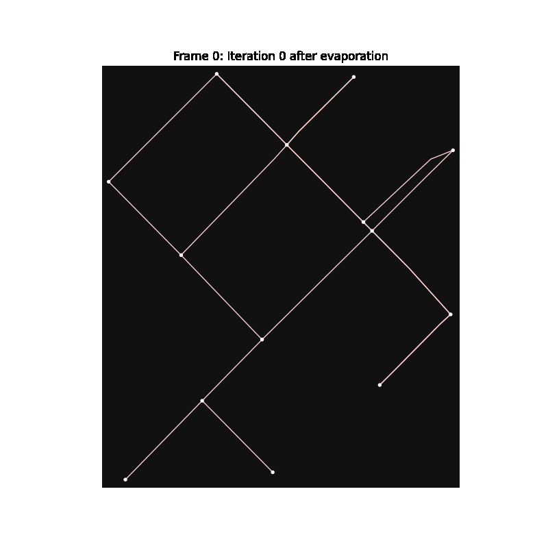
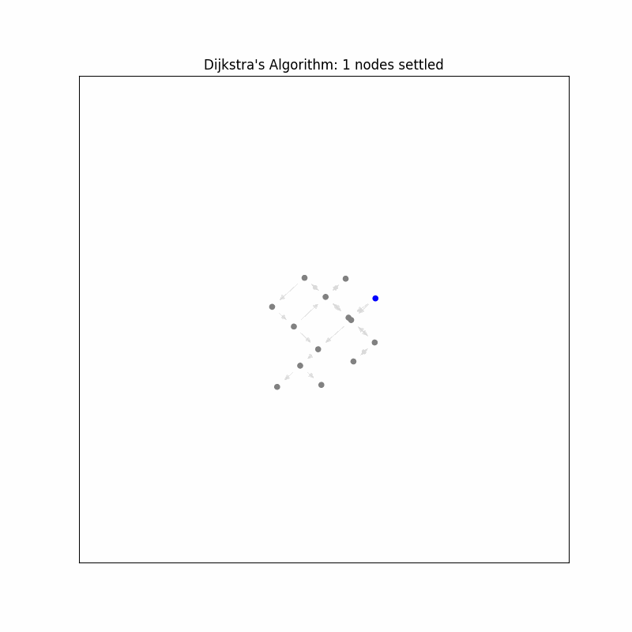

# Self-Organizing Path Networks: A Bio-Inspired Slime Mold Model

## **Abstract**
This project presents a bio-inspired approach to urban route optimization, inspired by the remarkable efficiency of slime molds in forming transport networks. In 2010, Japanese researchers conducted an experiment demonstrating how the slime mold *Physarum polycephalum* could replicate the Tokyo subway system's layout with surprising accuracy. By placing food sources at major city locations and allowing the slime mold to connect them, the organism developed a network that closely resembled the human-engineered railway system—suggesting that decentralized biological processes can optimize infrastructure with remarkable efficiency.

Leveraging this principle, our simulation applies a **slime mold-inspired optimization model** to an urban street network, replicating the natural behavior of *Physarum polycephalum* in a digital environment. Agents traverse a city graph, reinforcing paths through pheromone-like mechanisms, gradually forming optimized transport networks. Unlike traditional deterministic algorithms like **Dijkstra’s shortest path**, this model operates adaptively, self-organizing optimal routes through emergent behavior. The approach is applied to a road network extracted from OpenStreetMap, focusing on Downtown San Francisco. The results demonstrate that bio-mimetic computation offers a compelling alternative to classical optimization techniques, with potential applications in urban planning, logistics, and network resilience.

---

## **1. Introduction**
Nature has long inspired computational models for solving optimization problems. One of the most fascinating examples of biological intelligence comes from **slime mold (*Physarum polycephalum*)**, an amoeba-like organism capable of forming highly efficient transport networks. This ability was rigorously tested in the **famous Japanese experiment (2010)** where scientists mapped major railway stations of **Tokyo** onto an agar plate and placed oat flakes as food sources at each station. The slime mold naturally expanded, reinforcing its most effective pathways while eliminating inefficient routes. Incredibly, the resulting network closely resembled the human-designed Tokyo subway system—despite the mold having no central coordination.

This discovery raised profound questions: Could similar principles be applied to **real-world problems** such as **urban planning, network optimization, and logistics**? Unlike traditional methods that rely on **centralized computations**, **slime mold-inspired approaches** leverage **distributed, self-organizing decision-making** that dynamically adapts to changing conditions. Inspired by this, our project simulates a **computational slime mold** on a real-world **city street network**, allowing agents to explore, reinforce, and optimize routes in a decentralized manner.

---

## **2. Data Acquisition and Graph Representation**
To create a computational representation of an urban network, we extract real-world map data using **OSMnx**, a Python library that retrieves road networks from **OpenStreetMap (OSM)**. The selected study area is **Downtown San Francisco**, a dense urban region with a complex road network.

Once extracted, the network is transformed into a **graph** where:
- **Nodes** correspond to intersections (road junctions).
- **Edges** represent road segments, with weights proportional to **distance**.

This structured graph representation provides a navigable environment for simulated agents, allowing them to explore and form self-organized transport pathways, much like the slime mold in the Tokyo experiment.

---

## **3. Slime Mold-Inspired Optimization Algorithm**
The core of our simulation is a **pheromone-based, agent-driven model** that mimics how *Physarum polycephalum* naturally forms optimal networks. The algorithm follows three main principles:

### **3.1 Initialization of Pheromone Levels**
Each edge in the graph starts with a **baseline pheromone level**, representing an equal likelihood of traversal. Over time, these pheromone levels evolve based on agent activity.

### **3.2 Agent-Based Exploration**
In every iteration, simulated agents traverse the network, choosing edges **probabilistically** based on **pheromone concentration** and **distance weighting**. The shorter and more reinforced a path, the more attractive it becomes.

### **3.3 Pheromone Evaporation and Reinforcement**
To maintain **dynamic balance**, two key processes occur:
- **Pheromone Evaporation:** All edges experience **natural decay**, preventing over-concentration.
- **Pheromone Reinforcement:** Frequently used paths receive **additional pheromone deposits**, reinforcing their likelihood of selection.

Over multiple iterations, inefficient routes fade while strong, optimized pathways emerge naturally—just as observed in the Japanese slime mold experiment.

---

## **4. Performance Metrics and Evaluation**
To assess the model’s effectiveness, several key **quantitative metrics** are computed:

### **4.1 Simulation Time**
Total execution time, measuring the model’s computational efficiency.

### **4.2 Strong Edge Count**
Edges with **pheromone levels exceeding a defined threshold** are considered **“strong edges”**—indicative of optimized pathways.

### **4.3 Average Pheromone Level**
The mean pheromone value across all edges provides insights into overall reinforcement trends.

### **4.4 Pheromone Standard Deviation**
Higher standard deviations indicate **clear differentiation** between strong and weak edges, suggesting effective **network optimization**.

** Metrics from a Simulation Run:**
- **Simulation Time:** 0.009 seconds
- **Number of Strong Edges:** 17
- **Average Pheromone Level:** 113.94
- **Pheromone Standard Deviation:** 351.53

These results confirm that the algorithm effectively **identifies and reinforces efficient pathways** while allowing redundant paths to decay.

---

## **5. Real-World Applications and Future Directions**
The slime mold-inspired model has already seen successful **real-world implementations** in:
- **Tokyo Subway Optimization (Japan, 2010):** Demonstrating how slime molds replicate human-designed transport networks.
- **Wireless Sensor Networks:** Enhancing self-healing, adaptive routing in distributed systems.
- **Traffic and Logistics Planning:** Used for **autonomous vehicle routing** and **adaptive urban transport networks**.
- **Biological Network Design:** Applied in **neuromorphic computing** to model brain-like adaptive networks.

### **Expanding Our Model**
Future iterations of this project could focus on:
- **Scaling to Larger Networks:** Expanding beyond San Francisco to simulate entire metropolitan transport systems.
- **Comparative Benchmarking:** Evaluating **Dijkstra’s, A***, and **machine learning-based approaches** against slime mold models.
- **Dynamic Real-Time Data Integration:** Incorporating **live traffic congestion and environmental factors** to enhance adaptability.

---

## **6. Conclusion**
This project successfully applies **bio-inspired computing** to urban network optimization, demonstrating how a **self-organizing slime mold algorithm** can form efficient, decentralized transport networks. By replicating the **Tokyo subway experiment** in a digital simulation, we show that **emergent behavior** can rival traditional algorithmic approaches while offering greater **adaptability and resilience**. 

Unlike **deterministic methods** that compute a single optimal solution, our slime mold-inspired system continuously **evolves and adapts**, making it particularly suited for **dynamic environments**. The generated animation illustrates the step-by-step transformation of the road network, highlighting the power of **distributed intelligence** in solving complex optimization problems.

For collaborations, questions, or further exploration, feel free to reach out through my GitHub profile.

